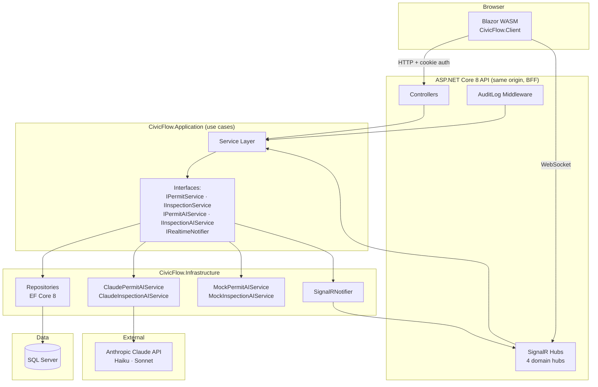

# CivicFlow

A production-quality permit and compliance management platform for government agencies — built in C# / .NET 8 / Blazor WebAssembly. Portfolio project targeting Windsor Solutions (Tigard, OR).

[](https://github.com/cs-keni/civicflow/actions/workflows/ci.yml)

---

## The Problem

Environmental and municipal agencies across the United States still process permit applications, schedule inspections, and track compliance violations through paper forms and disconnected spreadsheets. Windsor Solutions builds the software — nVIRO — that replaces these workflows for dozens of state and county agencies. CivicFlow models that exact domain using Windsor's stack: C#, .NET 8, Blazor WebAssembly, SQL Server, SignalR, and the Claude API.

---

## What It Does

CivicFlow replaces paper-based permit workflows with a modern cloud system covering permit applications, facility tracking, inspection scheduling, compliance violation tracking, public reporting, and immutable audit logging.

**Five user roles:**

| Role | What they do |
|---|---|
| Applicant | Submit permit applications, track status, respond to review comments |
| Agency Staff | Review applications, request changes, approve/deny, assign inspectors |
| Inspector | Schedule and record field inspections, generate AI-assisted public summaries |
| Admin | Manage users, view full audit log, oversee system activity |
| Public Viewer | Search approved permits and public compliance reports (unauthenticated) |

---

## Features

### Permit Lifecycle
- Draft → Submitted → Under Review → Changes Requested → Approved / Denied state machine with role-enforced transitions
- Every status change writes an immutable `PermitStatusHistory` record (actor ID, timestamp, new status) — regulatory audit trail by design
- Review comments with soft-delete (EF Core `HasQueryFilter`) — deleted comments invisible to all queries
- Real-time review queue: staff see new applications appear without refreshing (SignalR `staff-reviewers` group)

### AI-Assisted Workflows
- **Permit field suggestions** — Claude Haiku generates 3–5 plain-language requirements when an applicant starts a permit. Non-blocking; returns empty list on any failure
- **Inspection public summary** — Claude Sonnet converts technical field notes into 2–3 sentence citizen-facing summaries on inspection completion. Inspectors review and edit before publishing
- `AI_PROVIDER=mock` (default) enables full development with zero API calls and deterministic responses

### Inspections & Violations
- Inspection scheduling, completion (with field notes + overall rating), and cancellation
- Auto-generated public summary on completion (AI or manual fallback)
- Violation tracking with Oregon DEQ regulatory codes and severity classification
- Status progression: Open → Under Investigation → Resolved / Dismissed

### Public Transparency
- Unauthenticated facility search with full-text query support
- Facility compliance profile: open violations, recent inspections, compliance score (aggregate SQL view)
- All approved permits publicly visible — no login required

### Real-Time Updates (SignalR)
- Four domain hubs: `PermitStatusHub`, `ReviewQueueHub`, `InspectionHub`, `AdminActivityHub`
- Role-scoped groups: applicants get status change notifications, staff see live queue updates, inspectors receive scheduling events, admins get a full activity feed
- Fire-and-forget sends — hub failures never propagate to HTTP responses

---

## Screenshots

> Run `docker compose up --build` to start the app, then capture screenshots at `http://localhost:5000`.
> Commit screenshots to `docs/screenshots/` to populate the portfolio gallery.

| Page | What to capture |
|---|---|
| `/login` | Login form with demo credentials visible |
| `/dashboard` | Admin dashboard with stat cards and recent activity |
| `/permits` | Permit list with status badges and pagination |
| `/permits/new` | Step 2 of permit wizard with AI suggestions panel |
| `/permits/{id}` | Permit detail with review actions, history, and comments |
| `/inspections/{id}` | Completed inspection with AI public summary card |
| `/public/search` | Public facility search (unauthenticated) |

---

## Architecture



**Key architecture decisions:**

| Decision | Choice | Rationale |
|---|---|---|
| Auth token storage | HttpOnly `SameSite=Strict` cookie (BFF) | OWASP A07 — no tokens in browser storage or JS reach |
| WASM hosting | Served from within the API host | Same-origin eliminates SameSite cross-origin failures |
| Audit log consistency | Same DB transaction as business write | Atomic — zero silent audit gaps in a compliance platform |
| Formatted permit numbers | SQL Server SEQUENCE objects | Atomic, concurrency-safe, correct under parallel writes |
| Soft delete | EF Core `HasQueryFilter` on `ReviewComment` | Invisible by default — no forgotten `.Where(!IsDeleted)` |
| AI failure handling | Catch, log warning, return empty/null | Advisory features never gate core workflows |
| SignalR sends | Fire-and-forget with `.ContinueWith` error log | Hub failures must not propagate to HTTP responses |

---

## Tech Stack

| Layer | Technology |
|---|---|
| Language | C# 12 |
| Runtime | .NET 8 |
| Web API | ASP.NET Core 8 |
| Frontend | Blazor WebAssembly (.NET 8) |
| ORM | Entity Framework Core 8 |
| Database | SQL Server 2022 |
| Real-time | ASP.NET Core SignalR |
| Auth | ASP.NET Core Identity + HttpOnly cookie (BFF pattern) |
| AI | Anthropic Claude API (claude-haiku-4-5, claude-sonnet-4-6) |
| Validation | FluentValidation |
| Logging | Serilog |
| Testing | xUnit + Moq + FluentAssertions (87 tests) |
| Container | Docker + Docker Compose |
| CI/CD | GitHub Actions |

---

## Quick Start (Docker)

```bash
# 1. Clone and copy env config
git clone https://github.com/cs-keni/civicflow.git
cd civicflow
cp .env.example .env
# Edit .env: set SA_PASSWORD and optionally AI_PROVIDER=claude + ANTHROPIC_API_KEY

# 2. Start the stack
docker compose up --build

# 3. Open the app
open http://localhost:5000
```

**Demo credentials (seeded on first run):**

| Role | Email | Password |
|---|---|---|
| Admin | admin1@civicflow.dev | CivicFlow@2026! |
| Agency Staff | staff1@civicflow.dev | CivicFlow@2026! |
| Inspector | inspector1@civicflow.dev | CivicFlow@2026! |
| Applicant | applicant1@civicflow.dev | CivicFlow@2026! |

---

## Local Development

Requires: .NET 8 SDK, SQL Server (or LocalDB).

```bash
# Install tools
dotnet tool restore

# Update connection string in src/CivicFlow.API/appsettings.Development.json

# Run API + WASM (single process, hosted Blazor)
cd src/CivicFlow.API
dotnet run

# Run all tests (87 tests: 67 unit + 20 integration)
dotnet test

# Run specific suites
dotnet test tests/CivicFlow.UnitTests/
dotnet test tests/CivicFlow.IntegrationTests/
```

---

## Environment Variables

| Variable | Required | Default | Description |
|---|---|---|---|
| `SA_PASSWORD` | Yes (Docker) | — | SQL Server SA password |
| `AI_PROVIDER` | No | `mock` | `mock` or `claude` |
| `ANTHROPIC_API_KEY` | When `AI_PROVIDER=claude` | — | Anthropic API key |
| `ConnectionStrings__DefaultConnection` | Yes | — | SQL Server connection string |
| `ASPNETCORE_ENVIRONMENT` | No | `Production` | `Development`, `Production`, or `SwaggerGen` |

---

## AI Integration

CivicFlow integrates Claude for two advisory features:

1. **Permit field suggestions** (`GET /api/permits/ai-suggestions?permitType=Building`) — Claude Haiku generates 3–5 plain-language requirements when an applicant starts a permit. Always non-blocking; returns an empty list on any failure.

2. **Inspection public summary** — When an inspector marks an inspection complete, Claude Sonnet generates a 2–3 sentence plain-language summary from the field notes. Inspectors review and edit before publishing. Returns `null` on failure; inspection completion is never blocked.

**Provider switching:** Set `AI_PROVIDER=mock` (default) to use `MockPermitAIService` and `MockInspectionAIService` — deterministic responses with zero API calls. Set `AI_PROVIDER=claude` with `ANTHROPIC_API_KEY` for live Claude calls. The application throws at startup if `claude` is selected without a key.

---

## Testing

**87 tests, 0 failures.**

| Suite | Tests | What's covered |
|---|---|---|
| Unit (`CivicFlow.UnitTests`) | 67 | Service layer — Moq mocks for all repos and AI interfaces; happy path + role guards + state transition errors |
| Integration (`CivicFlow.IntegrationTests`) | 20 | `WebApplicationFactory<Program>` with InMemory DB; cookie auth flow, 401/403 role boundaries, paginated responses, soft-delete filter, seeded data |

Role boundary tests verify that Applicants receive `403 Forbidden` (not `401`) on staff-only permit actions and Admin-only audit endpoints — testing the `[Authorize(Roles=...)]` guards at the authorization filter level.

---

## CI/CD

Two GitHub Actions jobs:

| Job | Trigger | What it does |
|---|---|---|
| `test-mock` | Every push / PR | Build → unit tests → integration tests → Swagger export → Docker build |
| `test-real-ai` | Manual dispatch only | Claude connectivity smoke test (requires `vars.HAS_ANTHROPIC_KEY=true` + `ANTHROPIC_API_KEY` secret) |

The Swagger JSON is exported as a CI artifact on every `test-mock` run.

---

## Security & Accessibility

**Security:**
- **Auth**: ASP.NET Core Identity, HttpOnly `SameSite=Strict` cookies — no JWTs in browser storage (OWASP A07)
- **Input validation**: FluentValidation on all write endpoints; model binding rejects malformed requests before controllers execute
- **SQL injection**: EF Core parameterized queries throughout; no raw SQL except schema migrations
- **Soft delete**: `HasQueryFilter` on `ReviewComment` — deleted records invisible to all queries without explicit override
- **IDOR prevention**: Applicant-role queries scoped to `UserId` — users cannot access other applicants' resources
- **Rate limiting**: 5 login attempts per minute per IP (`AddFixedWindowLimiter`)
- **Security headers**: `X-Content-Type-Options: nosniff`, `X-Frame-Options: DENY`, `Referrer-Policy: strict-origin-when-cross-origin`
- **Audit log**: Immutable write on every business operation via `AuditLogMiddleware` (user ID, action, timestamp, entity)

**Accessibility (WCAG 2.1 AA):**
- All form inputs have associated `<label>` elements and `aria-required`
- Status badges use `aria-label` (not color alone) — passes WCAG 1.4.1 Use of Color
- Loading states use `role="status"` and `aria-label="Loading"`
- `aria-live="polite"` regions on dashboard and queue views for SignalR notifications
- Keyboard-navigable public search with visible focus indicators throughout

---

## T-SQL Artifacts

Beyond EF Core migrations, CivicFlow includes hand-authored T-SQL demonstrating database depth:

- `database/001_initial_schema.sql` — full DDL with constraints and FKs
- `database/003_indexes.sql` — 14 covering indexes, each with documented query rationale
- `database/sp_GetPermitActivityReport.sql` — stored procedure for compliance reporting (counts by type / status / date range)
- `database/vw_FacilityComplianceProfile.sql` — denormalized view with heuristic compliance score (open violations + recent inspections)
- Three SQL Server SEQUENCE objects — atomic, concurrency-safe formatted number generation for permits (`APP-YYYY-NNNN`), inspections (`INS-YYYY-NNNN`), violations (`VIO-YYYY-NNNN`)

---

## Azure Deployment

### Prerequisites

- Azure App Service (Linux, .NET 8 runtime, or Docker)
- Azure SQL Database (General Purpose, 2 vCores minimum)
- Azure Key Vault (for secrets)
- Azure Container Registry (optional, for Docker deploys)

### Steps

**1. Provision Azure SQL**
```bash
az sql server create --name civicflow-sql --resource-group civicflow-rg \
  --location westus2 --admin-user sqladmin --admin-password <password>
az sql db create --server civicflow-sql --resource-group civicflow-rg \
  --name CivicFlowDb --service-objective GP_Gen5_2
```

**2. Store secrets in Key Vault**
```bash
az keyvault create --name civicflow-kv --resource-group civicflow-rg --location westus2
az keyvault secret set --vault-name civicflow-kv --name ConnectionString \
  --value "Server=civicflow-sql.database.windows.net;Database=CivicFlowDb;..."
az keyvault secret set --vault-name civicflow-kv --name AnthropicApiKey \
  --value "<your-api-key>"
```

**3. Create App Service**
```bash
az appservice plan create --name civicflow-plan --resource-group civicflow-rg \
  --sku B2 --is-linux
az webapp create --name civicflow --resource-group civicflow-rg \
  --plan civicflow-plan --runtime "DOTNETCORE:8.0"
```

**4. Configure App Service settings**
```bash
az webapp config appsettings set --name civicflow --resource-group civicflow-rg --settings \
  AI_PROVIDER=claude \
  ASPNETCORE_ENVIRONMENT=Production \
  ANTHROPIC_API_KEY=@Microsoft.KeyVault(VaultName=civicflow-kv;SecretName=AnthropicApiKey)
az webapp config connection-string set --name civicflow --resource-group civicflow-rg \
  --connection-string-type SQLAzure \
  --settings DefaultConnection=@Microsoft.KeyVault(VaultName=civicflow-kv;SecretName=ConnectionString)
```

**5. Enable managed identity for Key Vault access**
```bash
az webapp identity assign --name civicflow --resource-group civicflow-rg
az keyvault set-policy --name civicflow-kv \
  --object-id <managed-identity-object-id> --secret-permissions get list
```

**6. Deploy**
```bash
dotnet publish src/CivicFlow.API -c Release -o ./publish
cd publish && zip -r ../civicflow.zip . && cd ..
az webapp deploy --name civicflow --resource-group civicflow-rg \
  --src-path civicflow.zip --type zip
# EF Core migrations run automatically on startup via SeedData.InitializeAsync
```

---

## Resume Bullets

- Built a production-quality full-stack permit and compliance platform in C#, ASP.NET Core 8, and Blazor WebAssembly with cookie-based BFF auth (OWASP Top 10 A07), entity-specific repositories, and a clean layered architecture targeting government agency workflows used by firms like Windsor Solutions
- Designed a relational schema in SQL Server with EF Core migrations, SQL Server SEQUENCE objects for concurrency-safe formatted permit numbering, stored procedures and aggregate views for compliance reporting, and audit-log middleware using transactional writes to guarantee regulatory traceability
- Integrated Claude API (claude-haiku-4-5 and claude-sonnet-4-6) with graceful degradation patterns — advisory features never gate core workflows — and environment-variable-switched mock/real provider abstraction backed by 87 automated tests (xUnit + Moq + FluentAssertions + WebApplicationFactory)
- Implemented ASP.NET Core SignalR with fire-and-forget hub sends, cookie-authenticated role-scoped groups, and 4 domain-specific hubs enabling live permit queue updates, applicant status notifications, and admin activity feeds
- Applied WCAG 2.1 AA accessibility and OWASP-aligned security across all pages including FluentValidation server-side validation, HasQueryFilter soft-delete protection, IDOR-scoped ownership queries, and paginated API endpoints throughout
