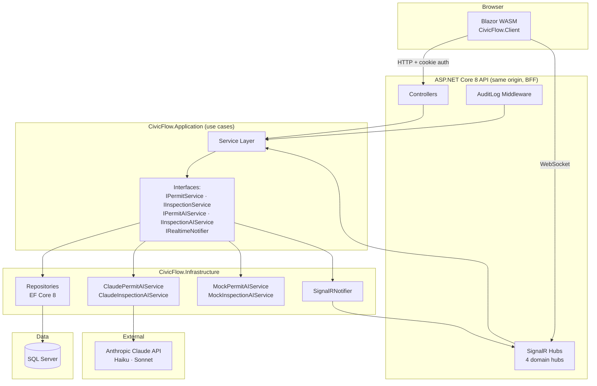

# CivicFlow

A production-quality permit and compliance management platform for government agencies — built in C# / .NET 8 / Blazor WebAssembly. Portfolio project targeting Windsor Solutions (Tigard, OR).

[](https://github.com/cs-keni/civicflow/actions/workflows/ci.yml)

---

## What It Does

CivicFlow replaces paper-based permit workflows with a modern cloud system. It covers permit applications, facility tracking, inspection scheduling, compliance violation tracking, public reporting, and immutable audit logging — the same domain as Windsor Solutions' nVIRO platform.

**Five user roles:**

| Role | What they do |
|---|---|
| Applicant | Submit permit applications, track status, respond to review comments |
| Agency Staff | Review applications, request changes, approve/deny, assign inspectors |
| Inspector | Schedule and record field inspections, generate AI-assisted public summaries |
| Admin | Manage users, view full audit log, oversee system activity |
| Public Viewer | Search approved permits and public compliance reports (unauthenticated) |

---

## Architecture



**Key architecture decisions:**

- **BFF pattern** — Blazor WASM is served by the API host at the same origin. Auth uses HttpOnly `SameSite=Strict` cookies; the WASM never touches JWTs or local storage (OWASP A07).
- **Clean layering** — Application layer defines interfaces; Infrastructure provides EF Core repos and Claude/Mock AI implementations. Application never imports Infrastructure.
- **AI provider switching** — `AI_PROVIDER=mock` (default in Docker) → zero API calls, deterministic responses. `AI_PROVIDER=claude` → real Claude calls with 8s timeout and graceful degradation. Core workflows never gate on AI availability.
- **SignalR** — 4 domain hubs (permit status, review queue, inspection, admin activity). Fire-and-forget sends; real-time updates are best-effort enhancements, never blocking.

---

## Tech Stack

| Layer | Technology |
|---|---|
| Language | C# 12 |
| Runtime | .NET 8 |
| Web API | ASP.NET Core 8 |
| Frontend | Blazor WebAssembly (.NET 8) |
| ORM | Entity Framework Core 8 |
| Database | SQL Server 2022 |
| Real-time | ASP.NET Core SignalR |
| Auth | ASP.NET Core Identity + HttpOnly cookie (BFF) |
| AI | Anthropic Claude API (claude-haiku-4-5, claude-sonnet-4-6) |
| Validation | FluentValidation |
| Logging | Serilog |
| Container | Docker + Docker Compose |
| CI/CD | GitHub Actions |

---

## Quick Start (Docker)

```bash
# 1. Clone and copy env config
git clone https://github.com/cs-keni/civicflow.git
cd civicflow
cp .env.example .env
# Edit .env: set SA_PASSWORD and optionally AI_PROVIDER=claude + ANTHROPIC_API_KEY

# 2. Start the stack
docker compose up --build

# 3. Open the app
open http://localhost:5000
```

**Demo credentials (seeded on first run):**

| Role | Email | Password |
|---|---|---|
| Admin | admin@civicflow.dev | Admin1234! |
| Agency Staff | staff@civicflow.dev | Staff1234! |
| Inspector | inspector@civicflow.dev | Inspector1234! |
| Applicant | applicant@civicflow.dev | Applicant1234! |

---

## Local Development

Requires: .NET 8 SDK, SQL Server (or LocalDB), Node.js (optional, for CSS tooling).

```bash
# Install tools
dotnet tool restore

# Update connection string in src/CivicFlow.API/appsettings.Development.json

# Run API + WASM (single process, hosted Blazor)
cd src/CivicFlow.API
dotnet run

# Run tests
dotnet test                          # all tests
dotnet test tests/CivicFlow.UnitTests/         # unit tests only
dotnet test tests/CivicFlow.IntegrationTests/  # integration tests only
```

---

## Environment Variables

| Variable | Required | Default | Description |
|---|---|---|---|
| `SA_PASSWORD` | Yes | — | SQL Server SA password (Docker only) |
| `AI_PROVIDER` | No | `mock` | `mock` or `claude` |
| `ANTHROPIC_API_KEY` | When `AI_PROVIDER=claude` | — | Anthropic API key |
| `ConnectionStrings__DefaultConnection` | Yes | — | SQL Server connection string |
| `ASPNETCORE_ENVIRONMENT` | No | `Production` | `Development`, `Production`, or `SwaggerGen` |

---

## AI Integration

CivicFlow integrates Claude for two advisory features:

1. **Permit field suggestions** (`GET /api/permits/ai-suggestions?permitType=Building`) — When an applicant starts a permit application, Claude Haiku generates 3–5 plain-language requirements to address. Always non-blocking; returns an empty list on any failure.

2. **Inspection public summary** — When an inspector marks an inspection complete, Claude Sonnet generates a 2–3 sentence plain-language summary of the field notes for public display. Inspectors review and edit before publishing. Returns `null` on failure; inspection completion is never blocked.

**Graceful degradation:** All AI calls use an 8-second timeout and are wrapped in try/catch. The application functions completely without an API key (`AI_PROVIDER=mock`).

---

## CI/CD

Two GitHub Actions jobs:

| Job | Trigger | What it does |
|---|---|---|
| `test-mock` | Every push / PR | Build → unit tests → integration tests → Swagger export → Docker build |
| `test-real-ai` | Manual dispatch only | Single Claude connectivity smoke test (requires `ANTHROPIC_API_KEY` secret) |

The Swagger JSON is exported as a CI artifact on every `test-mock` run. See `.github/workflows/ci.yml`.

---

## Azure Deployment

### Prerequisites

- Azure App Service (Linux, .NET 8 runtime, or Docker)
- Azure SQL Database (General Purpose, 2 vCores minimum)
- Azure Key Vault (for secrets)
- Azure Container Registry (optional, for Docker deploys)

### Steps

**1. Provision Azure SQL**
```bash
az sql server create --name civicflow-sql --resource-group civicflow-rg \
  --location westus2 --admin-user sqladmin --admin-password <password>
az sql db create --server civicflow-sql --resource-group civicflow-rg \
  --name CivicFlowDb --service-objective GP_Gen5_2
```

**2. Store secrets in Key Vault**
```bash
az keyvault create --name civicflow-kv --resource-group civicflow-rg --location westus2
az keyvault secret set --vault-name civicflow-kv --name ConnectionString \
  --value "Server=civicflow-sql.database.windows.net;Database=CivicFlowDb;..."
az keyvault secret set --vault-name civicflow-kv --name AnthropicApiKey \
  --value "<your-api-key>"
```

**3. Create App Service**
```bash
az appservice plan create --name civicflow-plan --resource-group civicflow-rg \
  --sku B2 --is-linux
az webapp create --name civicflow --resource-group civicflow-rg \
  --plan civicflow-plan --runtime "DOTNETCORE:8.0"
```

**4. Configure App Service settings**
```bash
az webapp config appsettings set --name civicflow --resource-group civicflow-rg --settings \
  AI_PROVIDER=claude \
  ASPNETCORE_ENVIRONMENT=Production \
  ANTHROPIC_API_KEY=@Microsoft.KeyVault(VaultName=civicflow-kv;SecretName=AnthropicApiKey)
az webapp config connection-string set --name civicflow --resource-group civicflow-rg \
  --connection-string-type SQLAzure \
  --settings DefaultConnection=@Microsoft.KeyVault(VaultName=civicflow-kv;SecretName=ConnectionString)
```

**5. Enable managed identity for Key Vault access**
```bash
az webapp identity assign --name civicflow --resource-group civicflow-rg
# Grant the managed identity access to Key Vault secrets
az keyvault set-policy --name civicflow-kv \
  --object-id <managed-identity-object-id> --secret-permissions get list
```

**6. Deploy**
```bash
# Via zip deploy (fastest for first deploy)
dotnet publish src/CivicFlow.API -c Release -o ./publish
cd publish && zip -r ../civicflow.zip . && cd ..
az webapp deploy --name civicflow --resource-group civicflow-rg \
  --src-path civicflow.zip --type zip

# EF Core migrations run automatically on startup via SeedData.InitializeAsync
```

### Docker on Azure (alternative)

```bash
# Push image to ACR
az acr create --name civicflowacr --resource-group civicflow-rg --sku Basic
az acr build --registry civicflowacr --image civicflow:latest \
  --file src/CivicFlow.API/Dockerfile .

# Deploy to App Service via ACR
az webapp config container set --name civicflow --resource-group civicflow-rg \
  --docker-custom-image-name civicflowacr.azurecr.io/civicflow:latest \
  --docker-registry-server-url https://civicflowacr.azurecr.io
```

---

## Security

- **Auth**: ASP.NET Core Identity, HttpOnly `SameSite=Strict` cookies — no JWTs in browser storage (OWASP A07)
- **Input validation**: FluentValidation on all write endpoints; model binding rejects malformed requests before controllers execute
- **SQL injection**: EF Core parameterized queries throughout; no raw SQL except schema migrations
- **Soft delete**: `HasQueryFilter` on `ReviewComment` — deleted records invisible to all queries without explicit override
- **Rate limiting**: 5 login attempts per minute per IP (`AddFixedWindowLimiter`)
- **Security headers**: `X-Content-Type-Options: nosniff`, `X-Frame-Options: DENY`, `Referrer-Policy: strict-origin-when-cross-origin`
- **Audit log**: Immutable write on every business operation via `AuditLogMiddleware` (user ID, action, timestamp, entity)

---

## Resume Bullets

- Built a production-quality full-stack permit and compliance platform in C#, ASP.NET Core 8, and Blazor WebAssembly with cookie-based BFF auth (OWASP Top 10 A07), entity-specific repositories, and a clean layered architecture targeting government agency workflows used by firms like Windsor Solutions
- Designed a relational schema in SQL Server with EF Core migrations, SQL Server SEQUENCE objects for concurrency-safe formatted permit numbering, and audit-log middleware using transactional writes to guarantee regulatory traceability
- Integrated Claude API (claude-haiku-4-5 and claude-sonnet-4-6) with graceful degradation patterns — advisory features never gate core workflows — and environment-variable-switched mock/real provider abstraction testable with zero API calls
- Implemented ASP.NET Core SignalR with fire-and-forget hub sends, cookie-authenticated role-scoped groups, and 4 domain-specific hubs enabling live permit queue updates, applicant status notifications, and admin activity feeds
- Containerized with Docker multi-stage builds and GitHub Actions CI with two jobs: always-on mock-AI integration suite and manual Claude connectivity smoke test guarded by secret availability
